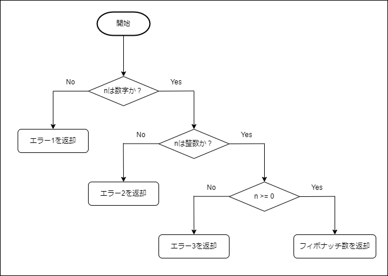

# フィボナッチ数を返すAPI <!-- omit in toc -->
API URL：[https://fibonacci.up.railway.app/fib?n=1](https://fibonacci.up.railway.app/fib?n=1)<br>
※ nに渡す数値を変更し、何番目のフィボナッチ数を返却するか指定
## 目次 <!-- omit in toc -->
---
- [ソースコード構成](#ソースコード構成)
- [概要](#概要)
  - [クエリパラメータ](#クエリパラメータ)
  - [環境](#環境)
  - [パッケージ管理ツール](#パッケージ管理ツール)
  - [ライブラリ](#ライブラリ)
  - [デプロイ環境](#デプロイ環境)
- [ローカル環境下での実装](#ローカル環境下での実装)
  - [環境構築](#環境構築)
  - [ローカルサーバ動作確認](#ローカルサーバ動作確認)
  - [ユニットテスト実行](#ユニットテスト実行)
- [テスト](#テスト)
  - [GETメソッドに対するレスポンス確認](#getメソッドに対するレスポンス確認)
  - [フィボナッチ数を返す関数の動作確認](#フィボナッチ数を返す関数の動作確認)

## ソースコード構成
---
```
fibonacci-railway-app
|------modules
|         |------fibonacci.js
|
|------.gitignore
|------app.js
|------app.test.js
|------package-lock.json
|------package.json
|------server.js
```

## 概要
---
### クエリパラメータ
- n：フィボナッチ数の番号を指定
### 環境
- Node.js
### パッケージ管理ツール
- npm
### ライブラリ
- API開発
  - Express
- テストツール
  - jest
  - supertest
### デプロイ環境
- railway.app

## ローカル環境下での実装
---
※ Node.jsとnpmをインストールしていることが前提<br>

### 環境構築
---
以下のコードを使用し、gitリポジトリをクローン
```
$ git clone https://github.com/kosuke5/fibonacci-railway-app.git
```
クローンしたディレクトリに移動
```
$ cd fibonacci-railway-app
```
npmによりパッケージをインストール
```
$ npm install
```

### ローカルサーバ動作確認
---
以下のコードを使用し、ローカルサーバを起動
```
$ npm start
```
ローカルサーバに対しレスポンス（10番目のフィボナッチ数）を確認<br>
※ ポート番号：**3000**
```
$ curl -X GET http://localhost:3000/fib?n=10
$ {"result":55}
```

### ユニットテスト実行
---
以下のコードを使用し、ユニットテストを実施
```
$ npm run test
```
 成功すると以下のような結果を表示
 ```
  PASS  ./app.test.js
  GET /fib
    √ クエリが文字列であった時のエラー確認 (20 ms)
    √ クエリが浮動小数であった時のエラー確認 (4 ms)
    √ クエリが0以下であった時のエラー確認 (3 ms)
    √ クエリが正しかった時のステータス確認 (3 ms)
  Fibonacci function
    √ 引数に「0」が与えられたら「0」が返ることを確認
    √ 引数に「1」が与えられたら「1」が返ることを確認
    √ 引数に「2」が与えられたら「1」が返ることを確認
    √ 引数に「3」が与えられたら「2」が返ることを確認
    √ 引数に「4」が与えられたら「3」が返ることを確認
    √ 引数に「5」が与えられたら「5」が返ることを確認
    √ 引数に「6」が与えられたら「8」が返ることを確認
    √ 引数に「7」が与えられたら「13」が返ることを確認
    √ 引数に「8」が与えられたら「21」が返ることを確認 (1 ms)
    √ 引数に「9」が与えられたら「34」が返ることを確認
    √ 引数に「10」が与えられたら「55」が返ることを確認
    √ 引数に「11」が与えられたら「89」が返ることを確認

Test Suites: 1 passed, 1 total
Tests:       16 passed, 16 total
Snapshots:   0 total
Time:        0.64 s, estimated 1 s
Ran all test suites.
```

## テスト
---
Web APIのテストは以下の2つに対して行う
- GETメソッドに対するレスポンス確認
- フィボナッチ数を返す関数の動作確認

### GETメソッドに対するレスポンス確認
---
想定したテストケースは以下のフローチャートを参照



- エラー1
  - ステータス：400
  - メッセージ："Invalid query. The query must be type of number."
- エラー2
  - ステータス：400
  - メッセージ："Invalid query. The query must be interger."
- エラー3
  - ステータス：400
  - メッセージ："Invalid query. The query must be more than zero."

### フィボナッチ数を返す関数の動作確認
---
以下のパターンに対し関数の動作を確認<br>
クエリパラメータ：n，答え：ans
- n = 0，ans = 0
- n = 1，ans = 1
- n = 2，ans = 1
- n = 3，ans = 2
- n = 4，ans = 3
- n = 5，ans = 5
- n = 6，ans = 8
- n = 7，ans = 13
- n = 8，ans = 21
- n = 9，ans = 34
- n = 10，ans = 55
- n = 11，ans = 89